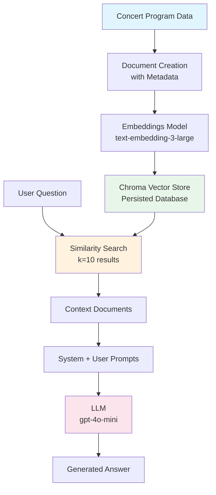

# LangChain RAG Workflow for Concert Programs

## Overview

This diagram explains how we use LangChain with concert program data to create a Retrieval Augmented Generation (RAG) system.

## Data Flow



## Step-by-Step Process

### 1. Database Creation (Ingestion)

| Step | Code Component | Description |
|------|----------------|-------------|
| Data Source | Concert programs (2009-2022) | Raw program data with dates, performers, pieces |
| Document Creation | `Document(page_content=..., metadata={...})` | Each program becomes a Document with text content and metadata (Year, Ensemble, etc.) |
| Embeddings | `OpenAIEmbeddings(model="text-embedding-3-large")` | Converts text to numerical vectors |
| Storage | `Chroma(persist_directory="./chroma_langchain_db")` | Vector database persisted locally |

### 2. Retrieval System

| Component | Purpose |
|-----------|---------|
| `vector_store.similarity_search(question, k=10)` | Finds top 10 most similar documents |
| State (TypedDict) | Passes data between pipeline steps |
| `StateGraph` | Orchestrates the retrieval → generation flow |

### 3. Prompt Engineering

**System Prompt:**
> "You are a helpful assistant. Use only the information provided in the context below to answer the question. If the answer is not in the context, say 'I don't know' or 'The information is not available.'"

**User Prompt Template:**
```
Context:
{context}

Question: {question}
```

### 4. Generation & Output

| Output | Description |
|--------|-------------|
| `result["answer"]` | LLM-generated response |
| `result["context"]` | Retrieved Document objects with metadata |
| `doc.page_content` | Raw text from concert program |
| `doc.metadata` | Year, ensemble, and other filters |

## Code Structure

```python
# 1. Setup
llm = init_chat_model("gpt-4o-mini", model_provider="openai")
embeddings = OpenAIEmbeddings(model="text-embedding-3-large")
vector_store = Chroma(collection_name="example_collection", ...)

# 2. Define State & Functions
class State(TypedDict):
    question: str
    context: List[Document]
    answer: str

def retrieve(state: State):
    retrieved_docs = vector_store.similarity_search(state["question"], k = 10)
    return {"context": retrieved_docs}

def generate(state: State):
    docs_content = "\n\n".join([doc.page_content for doc in state["context"]])
    message = prompt.invoke({"question": state["question"], "context": docs_content})
    response = llm.invoke(message)
    return {"answer": response.content}

# 3. Build Graph
graph_builder = StateGraph(State).add_sequence([retrieve, generate])
graph = graph_builder.compile()

# 4. Invoke
result = graph.invoke({"question": "Who has conducted the Chamber Singers?"})
```

## Metadata Filtering (Advanced)

The system supports metadata filters for refined context retrieval:
- **Year**: Filter by concert year
- **Ensemble**: Filter by group (Chamber Singers, Orchestra, etc.)
- **Season**: Fall/Spring semester

This improves answer accuracy by narrowing to relevant data subsets.